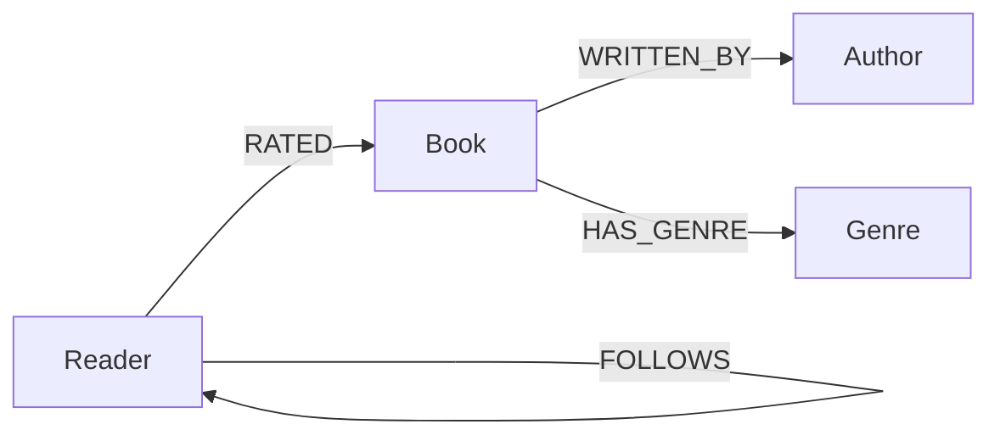

# BookRecommendationSystem

This is my submission for the Wexa AI take-home assignment. The task was pretty open — build something with CognoDB (a graph database) and pick whatever use case I wanted. I went with a book recommendation app, but I didn't want it to just spit out random book titles with no explanation. So the whole app is built around showing *why* a book was recommended — like, "this person rated it 5 stars and you both loved these 3 books too." I thought that made way more sense for a graph database than just a normal recommendation list.

> Live demo: **[ADD YOUR HOSTED URL HERE]**
> Screen recording: **[ADD YOUR RECORDING LINK HERE]**

---

## Table of contents

- [Why a graph database?](#why-a-graph-database)
- [Data model](#data-model)
- [Tech stack](#tech-stack)
- [Project structure](#project-structure)
- [Setup](#setup)
- [The main queries](#the-main-queries)
- [Screenshots](#screenshots)
- [Deployment](#deployment)
- [Error handling](#error-handling)

---

## Why a graph database?

When I was figuring out how to build the recommendation logic, I realized the question I actually wanted to ask was something like: "find people who liked the same books as me, then see what else they liked." That's basically a friend-of-a-friend type query — you're hopping from me, to a book, to another reader, to another book. In SQL that would mean joining the ratings table to itself a couple times, and it gets messier if I want to add more stuff later (which I did — the follow feature).

With a graph database it's a lot more natural because I can literally just write the path I'm thinking of:

```
(me) -[:RATED]-> (book) <-[:RATED]- (similar readers) -[:RATED]-> (recommended book)
```

That's basically one Cypher query instead of a bunch of joins. And when I added the `FOLLOWS` relationship later (so people can follow other readers), I didn't have to redo anything — I just added one more line to check if I already follow that similar reader. In a relational database that would've meant a whole new join table and rewriting the query. Here it was like 2 extra lines.

I'll be honest, with this little data (only ~200 nodes) a normal SQL database would run this fine too — it's not really about performance at this size. It's more that the graph model matches how I was actually thinking about the problem, so writing the queries was way easier than trying to force it into tables.

---

## Data model

```
(:Genre {name})
(:Author {name})
(:Book {id, title, publishedYear, avgRating})
(:Reader {id, name, joinedAt})

(:Book)   -[:WRITTEN_BY]->  (:Author)
(:Book)   -[:HAS_GENRE]->   (:Genre)
(:Reader) -[:RATED {score, ratedAt}]-> (:Book)
(:Reader) -[:FOLLOWS]->     (:Reader)
```



Some notes on why I set it up this way:

- I put `score` and `ratedAt` on the `RATED` relationship instead of on the `Reader` or `Book` node, because the rating isn't really about the reader OR the book by itself — it's about that specific pairing. This is the main advantage of using a graph db over a table, properties can live on the edges too, not just nodes.
- `FOLLOWS` points from `Reader` back to `Reader` (a self-relationship). I thought about making a separate node type for "social connections" but that seemed unnecessary — it's still the same 40 readers, just related to each other in two different ways.
- Genres and Authors are their own nodes instead of just being a string field on `Book`. This way I can also query "what books are in this genre" from the genre side, not just from the book side.

For seed data I used 15 genres, 25 authors, 120 books, 40 readers, and 652 ratings. I made 5 of the readers have almost no ratings on purpose so I'd have to handle the "not enough data yet" case instead of just assuming it always works.

---

## Tech stack

- **Database:** CognoDB Cloud (uses Cypher over Bolt)
- **Driver:** the official Neo4j .NET driver — CognoDB works with it directly, no special SDK needed
- **App:** Blazor Server (learned this for the first time doing this project, C# is my main language so it made sense)
- **Seeding:** a separate console app that reads a JSON file and loads everything into CognoDB

---

## Project structure

```
BookRecommendationSystem.sln
src/
├── BookRecommendationSystem.Data/        # shared stuff — connects to the DB, has all the repository classes
│   ├── CognoDbSettings.cs
│   ├── Neo4jConnection.cs
│   ├── Models.cs
│   ├── RecommendationRepository.cs
│   ├── ReaderRepository.cs
│   └── FollowRepository.cs
├── BookRecommendationSystem.Seed/        # run this once to load seed_data.json into CognoDB
│   ├── SeedModels.cs
│   ├── Program.cs
│   └── seed_data.json
└── BookRecommendationSystem.Web/         # the actual website
    ├── Program.cs
    ├── appsettings.json
    ├── Components/
    │   ├── Pages/
    │   │   ├── ReaderDashboard.razor     # "/" and "/reader/{id}" — pick a reader, see what they rated
    │   │   ├── Recommendations.razor     # "/recommendations/{id}" — recommendations with the "why"
    │   │   └── ReadingTwins.razor        # "/reading-twin/{id}" — who has the most similar taste to you
    │   └── Shared/
    │       ├── DbUnavailableBanner.razor
    │       ├── FollowButton.razor
    │       └── LoadingSkeleton.razor
    └── wwwroot/css/app.css
```

I split it into 3 projects (Data / Seed / Web) mainly because both the seeding script and the website need to talk to the database, so it made sense to keep all that DB logic in one shared project instead of copying it twice.

Every repository does the same thing: takes the DB driver in its constructor, and wraps each query in a try/catch so if CognoDB is down it throws one consistent error (`DatabaseUnavailableException`) instead of a random driver exception leaking out. I also made two shared components (`LoadingSkeleton` and `DbUnavailableBanner`) so every page has the same loading/empty/error look instead of me writing that markup three separate times.

---

## Setup

### 1. Create a CognoDB Cloud instance

Go to **https://console.cognodb.com/signup** and make an account — it's free, no credit card. Create a free `c0` instance, pick a region, and wait about a minute for it to spin up. You'll get a connection URI (`bolt+s://...`) and a password for the user `cognodb`. **Copy the password right away** — it only shows up once. (I found this out the annoying way and had to regenerate mine.)

### 2. Clone and restore

```bash
git clone <your-repo-url>
cd BookRecommendationSystem
dotnet restore
```

### 3. Add your connection secrets

I used `dotnet user-secrets` so the real password never ends up in a file that gets pushed to GitHub.

```bash
# Web project
cd src/BookRecommendationSystem.Web
dotnet user-secrets init
dotnet user-secrets set "CognoDb:Uri" "bolt+s://<your-instance-id>.databases.cognodb.cloud"
dotnet user-secrets set "CognoDb:User" "cognodb"
dotnet user-secrets set "CognoDb:Password" "<your-generated-password>"

# Seed project — has its own secrets, so you have to set it again here
cd ../BookRecommendationSystem.Seed
dotnet user-secrets init
dotnet user-secrets set "CognoDb:Uri" "bolt+s://<your-instance-id>.databases.cognodb.cloud"
dotnet user-secrets set "CognoDb:User" "cognodb"
dotnet user-secrets set "CognoDb:Password" "<your-generated-password>"
```

### 4. Run the seed script

```bash
cd src/BookRecommendationSystem.Seed
dotnet run
```

You should see something like this:

```
Loaded from file: 15 genres, 25 authors, 120 books, 40 readers, 652 ratings
Connected to CognoDB.
  Genres: 15
  Authors: 25
  Books: 120 (+ WRITTEN_BY, HAS_GENRE relationships)
  Readers: 40
  Ratings: 652
Seed complete.
```

It uses `MERGE` instead of `CREATE` so you can run it more than once without duplicating everything (found this out because I ran it twice by accident while testing).

### 5. Run the app

```bash
cd src/BookRecommendationSystem.Web
dotnet run
```

Open the localhost link it gives you. You land on the reader list — click a reader to see their ratings, then check out their recommendations or their "reading twin."

---

## The main queries

**1. Explainable recommendations (the main feature)**

```cypher
MATCH (me:Reader {id: $readerId})-[r1:RATED]->(shared:Book)<-[r2:RATED]-(similar:Reader)
WHERE r1.score >= 4 AND r2.score >= 4 AND similar <> me
WITH me, similar, collect(shared.title) AS sharedBooks, count(shared) AS overlap
ORDER BY overlap DESC
LIMIT 10
MATCH (similar)-[r3:RATED]->(rec:Book)
WHERE r3.score >= 4
  AND NOT EXISTS { MATCH (me)-[:RATED]->(rec) }
WITH rec, me, similar, r3, sharedBooks,
     EXISTS { MATCH (me)-[:FOLLOWS]->(similar) } AS isFollowed
WITH rec,
     collect({readerId: similar.id, readerName: similar.name, score: r3.score,
               sharedBooks: sharedBooks, isFollowed: isFollowed}) AS evidence
RETURN rec.title AS title, rec.avgRating AS avgRating, evidence
ORDER BY size(evidence) DESC, avgRating DESC
LIMIT 5
```

What it's doing: find other readers who rated the same books as me highly, then look at what else they rated highly that I haven't read yet. While I'm already walking through those "similar readers," I also just check if I follow them (`EXISTS { MATCH (me)-[:FOLLOWS]->(similar) }`) — that's basically free since I'm already there. This is honestly the query I'm most proud of since it does both the recommending AND the explaining in one go, instead of me needing two separate queries.

**2. Following someone**

```cypher
MATCH (a:Reader {id: $readerId}), (b:Reader {id: $targetId})
MERGE (a)-[:FOLLOWS]->(b)
```

I used `MERGE` here instead of `CREATE` because if someone clicks "follow" twice (like a double click or a slow network so they click again), `CREATE` would make two separate `FOLLOWS` edges between the same two people, which doesn't make sense. `MERGE` just makes sure there's only ever one.

**3. Reading twin**

```cypher
MATCH (me:Reader {id: $readerId})-[r1:RATED]->(b:Book)<-[r2:RATED]-(other:Reader)
WHERE other <> me
WITH other, count(b) AS sharedBooks, avg(abs(r1.score - r2.score)) AS avgScoreGap
RETURN other.id AS twinId, other.name AS twin, sharedBooks, avgScoreGap
ORDER BY sharedBooks DESC, avgScoreGap ASC
LIMIT 1
```

This finds whoever has rated the most of the same books as you, and among those, whoever's scores are closest to yours on average. It's a "stretch feature" I added after the main recommendation stuff was working.

All of these use `.WithParameters()` from the driver instead of putting the reader ID directly into the query string — I made sure not to do any string concatenation since that's a bad practice (Cypher injection, same idea as SQL injection).

---

## Screenshots

> TODO: add these once I finish the CSS pass. Need:
> 1. Reader dashboard (`/`)
> 2. A reader's profile with their ratings (`/reader/{id}`)
> 3. Recommendations page with a card expanded showing the evidence (`/recommendations/{id}`)
> 4. Reading twin page (`/reading-twin/{id}`)

```markdown


```

---

## Deployment

Blazor Server apps need websockets to stay connected (that's how it sends updates back to the browser without a page refresh), so I had to pick a host that supports that. I used Render's free tier:

1. Push the repo to GitHub first (Render deploys from GitHub).
2. On Render: click **New → Web Service** and connect the repo.
3. Root directory: leave blank since the `.sln` file is at the top of the repo.
4. Build command:
   ```
   dotnet publish src/BookRecommendationSystem.Web -c Release -o out
   ```
5. Start command:
   ```
   dotnet out/BookRecommendationSystem.Web.dll
   ```
6. Add these environment variables in Render's dashboard (not in a file that gets committed):
   ```
   CognoDb__Uri=bolt+s://your-instance-id.databases.cognodb.cloud
   CognoDb__User=cognodb
   CognoDb__Password=your-generated-password
   ASPNETCORE_ENVIRONMENT=Production
   ```
   Quick note — it's a double underscore (`__`), not a colon, because that's how .NET reads environment variables as nested config.
7. Click deploy and wait for the build to finish. Then test the same flow as local: go to `/`, pick a reader, check recommendations, check reading twin.

---

## Error handling

If CognoDB can't be reached (wrong password, instance paused, whatever), the app shows a little banner saying it can't connect, with a retry button, instead of just crashing or showing a blank page. I did this by having every repository catch the connection-related exceptions from the Neo4j driver and turn them into one custom exception (`DatabaseUnavailableException`), so the actual page components only ever have to handle one type of error no matter which query failed.
